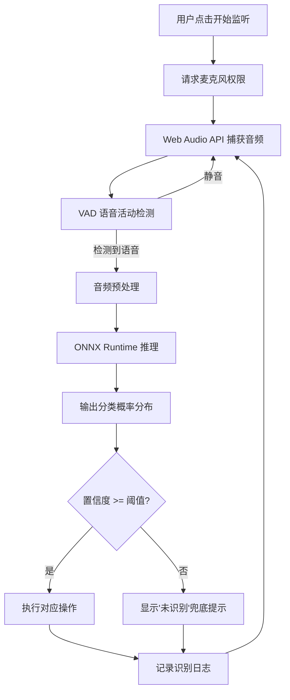

## 1. 产品概述

语音指令识别工具（VoiceCmd）是一款基于浏览器的实时语音指令分类与执行系统。用户通过麦克风说出"打开设置""截图""下一首"等预定义指令，系统利用 Web Audio API 捕获音频，通过 ONNX Runtime 加载轻量级语音分类模型实时推理，输出分类结果并触发对应的系统/应用操作。后端仅负责模型版本管理与日志收集。

- 核心价值：将语音交互以纯前端推理方式落地，零延迟本地识别，隐私安全
- 目标用户：需要语音快捷操作的桌面端用户、无障碍辅助使用者、智能家居控制者

## 2. 核心功能

### 2.1 用户角色

| 角色 | 注册方式 | 核心权限 |
|------|----------|----------|
| 普通用户 | 无需注册 | 使用语音识别、查看历史记录 |
| 管理员 | 本地配置 | 模型版本管理、查看日志面板 |

### 2.2 功能模块

1. **主控制台页面**：语音捕获状态、实时波形可视化、识别结果展示、置信度仪表盘、操作执行反馈
2. **指令管理页面**：已注册指令列表、指令映射配置、自定义指令添加/编辑
3. **系统日志页面**：识别历史记录、模型版本信息、性能统计

### 2.3 页面详情

| 页面名称 | 模块名称 | 功能描述 |
|----------|----------|----------|
| 主控制台 | 语音捕获区 | 麦克风状态指示、实时音频波形可视化、音量电平表 |
| 主控制台 | 识别结果区 | 分类结果文字、置信度环形进度条、概率分布柱状图、未识别提示 |
| 主控制台 | 操作反馈区 | 触发动作名称、执行状态（成功/失败）、操作历史流 |
| 主控制台 | 模型状态栏 | 当前模型版本、推理延迟、加载状态指示 |
| 指令管理 | 指令列表 | 已注册指令表格、分类标签、置信度阈值设置 |
| 指令管理 | 指令编辑 | 添加/编辑指令映射（语音标签→操作类型→执行参数） |
| 系统日志 | 识别日志 | 时间戳、输入音频片段、识别结果、置信度、执行动作 |
| 系统日志 | 性能面板 | 平均推理延迟、识别成功率、未识别率、模型版本切换 |

## 3. 核心流程

用户点击"开始监听"→ 浏览器请求麦克风权限 → Web Audio API 捕获音频流 → VAD 检测语音片段 → 音频预处理（重采样/归一化/特征提取）→ ONNX Runtime 推理 → 输出分类概率分布 → 置信度判断（高于阈值→执行动作，低于阈值→显示"未识别"）→ 记录日志 → 继续监听

## 4. 用户界面设计

### 4.1 设计风格

- **主色调**：深色科技风 — 深灰黑底色（#0D1117），搭配荧光青绿（#00FFC8）作为高亮强调色，辅助色用冷灰蓝（#8B949E）
- **按钮风格**：圆角药丸形按钮，带有发光边框效果（glow），激活态荧光青绿脉冲动画
- **字体**：显示字体使用 JetBrains Mono（等宽科技感），正文使用 Noto Sans SC（中文清晰可读）
- **布局风格**：左侧导航栏 + 右侧主内容区，卡片式模块布局，玻璃态（glassmorphism）卡片效果
- **图标风格**：线性描边图标（Lucide Icons），荧光青绿色

### 4.2 页面设计概览

| 页面名称 | 模块名称 | UI 元素 |
|----------|----------|----------|
| 主控制台 | 语音捕获区 | 圆形麦克风按钮（脉冲动画）、实时波形 Canvas、音量电平条 |
| 主控制台 | 识别结果区 | 大字分类结果、环形置信度仪表、概率分布横向柱状图、未识别红色闪烁提示 |
| 主控制台 | 操作反馈区 | 操作名称标签、状态图标（✓/✗）、滚动历史列表 |
| 主控制台 | 模型状态栏 | 底部状态条、模型版本号、推理延迟毫秒数、加载进度条 |
| 指令管理 | 指令列表 | 玻璃态卡片列表、标签色块、置信度阈值滑块 |
| 指令管理 | 指令编辑 | 侧滑抽屉面板、表单输入框、操作类型下拉选择 |
| 系统日志 | 识别日志 | 时间轴式日志列表、音频波形缩略图、结果标签 |
| 系统日志 | 性能面板 | 统计数字卡片、迷你折线图 |

### 4.3 响应式设计

- 桌面优先设计，主控台在 1280px+ 宽度下展示完整三栏布局
- 平板端（768px-1279px）波形与结果区垂直堆叠，操作反馈区折叠为底部面板
- 移动端（<768px）单栏布局，底部固定麦克风按钮

### 4.4 3D 场景指引

不适用
