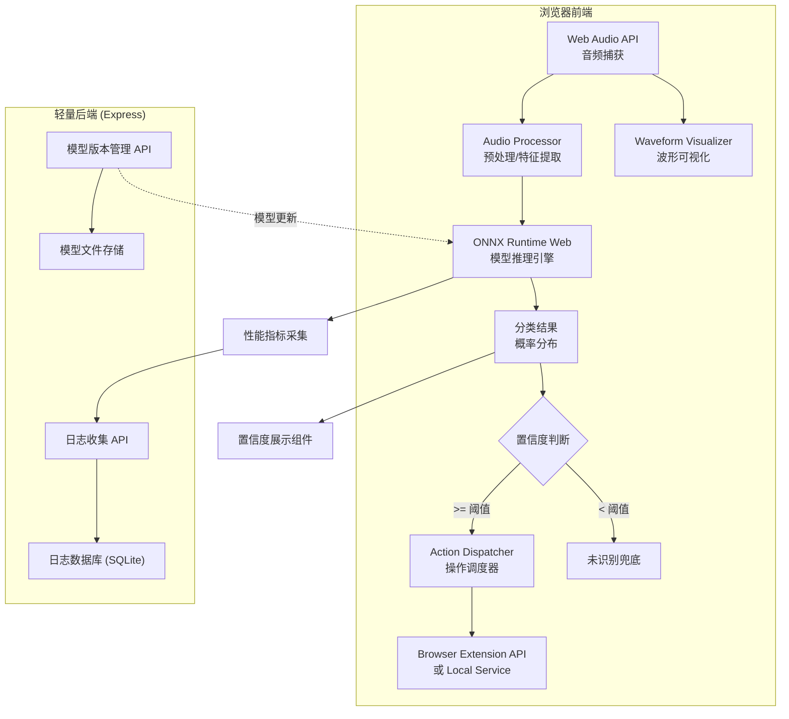
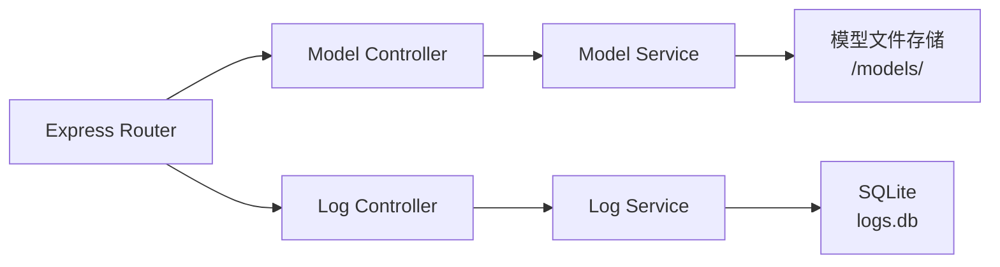
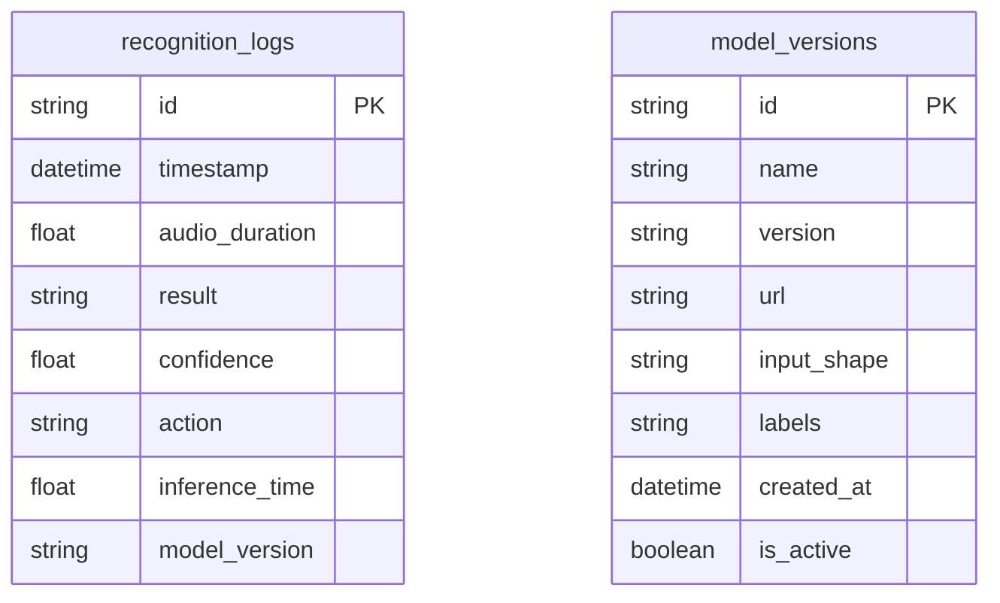

## 1. 架构设计



## 2. 技术说明

- **前端**：React@18 + TailwindCSS@3 + Vite
- **初始化工具**：Vite
- **音频处理**：Web Audio API（AudioContext, AnalyserNode, ScriptProcessorNode/AudioWorklet）
- **模型推理**：ONNX Runtime Web（onnxruntime-web）加载 MobileNet-like 语音分类 ONNX 模型
- **后端**：Express@4（仅模型版本管理 + 日志收集）
- **数据库**：SQLite（日志存储）
- **通信**：前端 ↔ 后端 REST API；前端 ↔ 浏览器扩展 Chrome Extension API / Native Messaging

## 3. 路由定义

| 路由 | 用途 |
|------|------|
| `/` | 主控制台 — 语音捕获、实时识别、操作执行 |
| `/commands` | 指令管理 — 已注册指令列表、添加/编辑指令映射 |
| `/logs` | 系统日志 — 识别历史、性能统计、模型版本信息 |

## 4. API 定义

### 4.1 模型版本管理 API

```typescript
interface ModelInfo {
  id: string;
  name: string;
  version: string;
  url: string;
  inputShape: number[];
  labels: string[];
  createdAt: string;
}

// GET /api/models/latest — 获取最新模型信息
type GetLatestModelResponse = ModelInfo;

// GET /api/models — 获取所有模型版本列表
type GetModelsResponse = ModelInfo[];
```

### 4.2 日志收集 API

```typescript
interface RecognitionLog {
  id: string;
  timestamp: string;
  audioDuration: number;
  result: string;
  confidence: number;
  action: string | null;
  inferenceTime: number;
  modelVersion: string;
}

// POST /api/logs — 提交识别日志
type PostLogRequest = Omit<RecognitionLog, "id">;
type PostLogResponse = { success: boolean };

// GET /api/logs — 查询识别日志（分页）
type GetLogsQuery = { page?: number; limit?: number; startDate?: string; endDate?: string };
type GetLogsResponse = { total: number; logs: RecognitionLog[] };

// GET /api/logs/stats — 获取性能统计
type GetStatsResponse = {
  totalRecognitions: number;
  avgInferenceTime: number;
  successRate: number;
  unrecognizedRate: number;
  topCommands: { command: string; count: number }[];
};
```

## 5. 服务端架构图



## 6. 数据模型

### 6.1 数据模型定义



### 6.2 数据定义语言

```sql
CREATE TABLE recognition_logs (
    id TEXT PRIMARY KEY,
    timestamp DATETIME NOT NULL,
    audio_duration REAL NOT NULL,
    result TEXT NOT NULL,
    confidence REAL NOT NULL,
    action TEXT,
    inference_time REAL NOT NULL,
    model_version TEXT NOT NULL
);

CREATE TABLE model_versions (
    id TEXT PRIMARY KEY,
    name TEXT NOT NULL,
    version TEXT NOT NULL,
    url TEXT NOT NULL,
    input_shape TEXT NOT NULL,
    labels TEXT NOT NULL,
    created_at DATETIME DEFAULT CURRENT_TIMESTAMP,
    is_active BOOLEAN DEFAULT 0
);

CREATE INDEX idx_logs_timestamp ON recognition_logs(timestamp);
CREATE INDEX idx_logs_result ON recognition_logs(result);
```

## 7. ONNX 模型集成方案

### 7.1 模型架构

采用轻量级 MobileNet-like 卷积网络，输入为 MFCC 特征（40 维 × 32 帧），输出为指令类别概率分布。

### 7.2 前端推理流程

1. 从后端获取最新模型 URL 和元数据
2. 使用 `onnxruntime-web` 的 `InferenceSession.create()` 加载模型
3. Web Audio API 捕获音频 → AudioWorklet 处理 → 计算 MFCC 特征
4. 构造 ONNX Tensor 输入 → `session.run()` 推理
5. Softmax 输出取 argmax 得到分类，同时获取置信度
6. 置信度 < 阈值（默认 0.6）时触发"未识别"兜底

### 7.3 模拟模型

开发阶段使用内置的模拟推理器（基于音频能量和过零率的简单分类器），无需真实 ONNX 模型即可演示完整流程。生产环境切换为真实 ONNX 模型。
